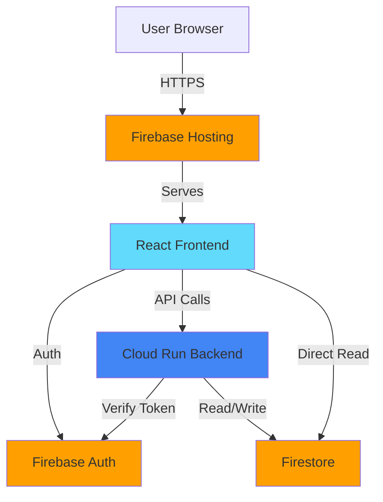

# Carbon Footprint Tracker - Scaffolding Plan

## 📋 Project Overview

Building a Carbon Footprint Awareness web app (v1/MVP) that allows users to:
- Take a baseline carbon quiz and get a starting "Carbon Score"
- Log daily activities (transport/food/energy/shopping) with estimated CO2 impact
- View a dashboard with trends and category breakdown
- Receive 3-5 rule-based personalized tips per week
- Use real user accounts via Firebase Authentication

**Hard Constraints:**
- Must run entirely on Google Cloud's Always Free tier and Firebase's Spark plan
- Backend on Cloud Run, frontend on Firebase Hosting
- Data in Firestore (Native mode), auth via Firebase Authentication
- No paid APIs, no ML services, no third-party integrations

**Stack:**
- TypeScript throughout
- React + Vite for frontend, Tailwind CSS, Recharts
- Node.js + Express for backend API
- npm workspaces monorepo with /frontend, /backend, /shared

## 🏗️ Monorepo Folder Structure

```
cft/
├── .gitignore
├── .env.example                    # Shared Firebase config
├── package.json                    # Root package.json with workspaces
├── tsconfig.json                   # Base TypeScript config
├── .eslintrc.json                  # ESLint config
├── .prettierrc.json                # Prettier config
├── README.md                       # Setup instructions
├── ARCHITECTURE.md                 # System architecture documentation
├── firestore.rules                 # Firestore security rules
├── firebase.json                   # Firebase configuration
│
├── docs/                           # Additional documentation
│   ├── API.md                      # API endpoint specifications
│   ├── DEPLOYMENT.md               # Deployment guide
│   └── CALCULATIONS.md             # CO2 calculation methodology
│
├── shared/                         # Shared TypeScript types/interfaces
│   ├── package.json
│   ├── tsconfig.json
│   └── src/
│       ├── index.ts
│       ├── types/
│       │   ├── user.types.ts       # User, profile types
│       │   ├── activity.types.ts   # Activity log types
│       │   ├── quiz.types.ts       # Baseline quiz types
│       │   ├── score.types.ts      # Carbon score types
│       │   └── tip.types.ts        # Personalized tip types
│       └── interfaces/
│           ├── api.interfaces.ts   # API request/response interfaces
│           └── firestore.interfaces.ts  # Firestore document interfaces
│
├── backend/                        # Express API on Cloud Run
│   ├── package.json
│   ├── tsconfig.json
│   ├── Dockerfile                  # For Cloud Run deployment
│   ├── .dockerignore
│   └── src/
│       ├── index.ts                # Express app entry point
│       ├── config/
│       │   └── firebase.ts         # Firebase Admin SDK setup
│       ├── middleware/
│       │   ├── auth.ts             # Firebase auth verification
│       │   └── errorHandler.ts     # Error handling middleware
│       ├── routes/
│       │   ├── index.ts            # Route aggregator
│       │   ├── quiz.routes.ts      # Baseline quiz endpoints
│       │   ├── activities.routes.ts # Activity logging endpoints
│       │   ├── scores.routes.ts    # Carbon score endpoints
│       │   └── tips.routes.ts      # Personalized tips endpoints
│       └── utils/
│           ├── calculations.ts     # CO2 calculation logic
│           └── tipGenerator.ts     # Rule-based tip generation
│
└── frontend/                       # React + Vite app
    ├── package.json
    ├── tsconfig.json
    ├── tsconfig.node.json
    ├── vite.config.ts
    ├── tailwind.config.js
    ├── postcss.config.js
    ├── index.html
    └── src/
        ├── main.tsx                # App entry point
        ├── App.tsx                 # Root component
        ├── vite-env.d.ts
        ├── config/
        │   └── firebase.ts         # Firebase client SDK setup
        ├── components/
        │   ├── layout/             # Layout components
        │   ├── quiz/               # Quiz components
        │   ├── activities/         # Activity logging components
        │   ├── dashboard/          # Dashboard & charts
        │   └── tips/               # Tips display components
        ├── pages/
        │   ├── Home.tsx
        │   ├── Quiz.tsx
        │   ├── Dashboard.tsx
        │   ├── Activities.tsx
        │   └── Login.tsx
        ├── hooks/
        │   ├── useAuth.ts          # Firebase auth hook
        │   └── useFirestore.ts     # Firestore data hooks
        ├── services/
        │   └── api.ts              # Backend API client
        ├── utils/
        │   └── formatters.ts       # Data formatting utilities
        └── styles/
            └── index.css           # Tailwind imports
```

## 📊 High-Level Architecture



### Data Flow

1. **Authentication Flow:**
   - User signs up/logs in via Firebase Authentication
   - Frontend receives auth token
   - Token sent with all API requests to backend
   - Backend verifies token with Firebase Admin SDK

2. **Quiz Flow:**
   - User completes baseline quiz in frontend
   - Frontend sends responses to backend API
   - Backend calculates carbon score
   - Backend stores quiz response and initial score in Firestore
   - Frontend displays results

3. **Activity Logging Flow:**
   - User logs activity in frontend
   - Frontend sends activity data to backend API
   - Backend calculates CO2 impact
   - Backend stores activity in Firestore
   - Backend updates user's carbon score
   - Frontend refreshes dashboard

4. **Dashboard Flow:**
   - Frontend reads user's activities and scores from Firestore (direct read)
   - Frontend aggregates and visualizes data with Recharts
   - Real-time updates via Firestore listeners

5. **Tips Generation Flow:**
   - Backend cron job (or manual trigger) runs weekly
   - Backend analyzes user's activities
   - Backend generates 3-5 personalized tips using rule-based logic
   - Backend stores tips in Firestore
   - Frontend displays tips to user

## 🗄️ Firestore Collections

### users
- **Document ID:** Firebase Auth UID
- **Fields:**
  - `displayName: string`
  - `email: string`
  - `createdAt: timestamp`
  - `baselineScore: number`
  - `preferences: object`

### activities
- **Document ID:** Auto-generated
- **Fields:**
  - `userId: string` (indexed)
  - `date: timestamp` (indexed)
  - `category: string` (transport|food|energy|shopping)
  - `type: string` (specific activity type)
  - `amount: number`
  - `unit: string`
  - `co2Impact: number` (kg CO2e)
  - `createdAt: timestamp`

### quizResponses
- **Document ID:** userId
- **Fields:**
  - `userId: string`
  - `responses: object` (quiz answers)
  - `calculatedScore: number`
  - `completedAt: timestamp`

### carbonScores
- **Document ID:** Auto-generated
- **Fields:**
  - `userId: string` (indexed)
  - `date: timestamp` (indexed)
  - `score: number`
  - `breakdown: object` (by category)
  - `calculatedAt: timestamp`

### tips
- **Document ID:** Auto-generated
- **Fields:**
  - `userId: string` (indexed)
  - `weekStart: timestamp`
  - `tips: array` (3-5 tip objects)
  - `generatedAt: timestamp`
  - `viewed: boolean`

## 🔧 Technology Stack Details

### Frontend
- **React 18** with TypeScript
- **Vite** - Fast build tool and dev server
- **Tailwind CSS** - Utility-first styling
- **Recharts** - Data visualization library
- **Firebase SDK** - Authentication and Firestore client

### Backend
- **Node.js** with Express and TypeScript
- **Firebase Admin SDK** - Server-side Firebase operations
- **Cloud Run** - Containerized serverless deployment

### Shared
- **TypeScript types/interfaces** - Shared across frontend and backend
- Exported as `@cft/shared` npm package

### Development Tools
- **ESLint** - Code linting
- **Prettier** - Code formatting
- **npm workspaces** - Monorepo management

## 🔐 Security & Configuration

### Firestore Security Rules
Basic rules allowing authenticated users to:
- Read/write their own user document
- Read/write their own activities, scores, and tips
- No cross-user data access

### Environment Configuration
Single `.env.example` file with placeholders for:
- Firebase project configuration
- Firebase Admin SDK credentials
- Backend API URL
- Cloud Run deployment settings

### Authentication
- Firebase Authentication tokens verified on backend
- All API endpoints require valid auth token
- Frontend stores token in memory (not localStorage for security)

## 📝 Files to Create

### Root Configuration
1. `package.json` - npm workspaces setup
2. `tsconfig.json` - Base TypeScript configuration
3. `.eslintrc.json` - ESLint rules
4. `.prettierrc.json` - Prettier formatting rules
5. `.gitignore` - Git ignore patterns
6. `.env.example` - Environment variable template

### Documentation
1. `README.md` - Setup and development instructions
2. `ARCHITECTURE.md` - Detailed system architecture
3. `docs/API.md` - API endpoint specifications
4. `docs/DEPLOYMENT.md` - Deployment guide
5. `docs/CALCULATIONS.md` - CO2 calculation methodology

### Firebase
1. `firestore.rules` - Firestore security rules
2. `firebase.json` - Firebase CLI configuration

### Shared Package
1. `shared/package.json` - Package configuration
2. `shared/tsconfig.json` - TypeScript config
3. `shared/src/index.ts` - Main export file
4. Type definition files for all entities

### Backend Package
1. `backend/package.json` - Dependencies and scripts
2. `backend/tsconfig.json` - TypeScript config
3. `backend/Dockerfile` - Container definition
4. `backend/.dockerignore` - Docker ignore patterns
5. `backend/src/index.ts` - Express app entry
6. Route, middleware, and utility files

### Frontend Package
1. `frontend/package.json` - Dependencies and scripts
2. `frontend/tsconfig.json` - TypeScript config
3. `frontend/vite.config.ts` - Vite configuration
4. `frontend/tailwind.config.js` - Tailwind config
5. `frontend/postcss.config.js` - PostCSS config
6. `frontend/index.html` - HTML entry point
7. `frontend/src/main.tsx` - React entry point
8. Component, page, hook, and service files

## ✅ Deliverables

This scaffolding plan will deliver:

1. ✅ Complete monorepo structure with npm workspaces
2. ✅ TypeScript configured across all packages with proper path resolution
3. ✅ ESLint + Prettier for consistent code quality
4. ✅ Comprehensive .gitignore for Node.js + Firebase projects
5. ✅ Basic Firestore security rules
6. ✅ Environment configuration template
7. ✅ Detailed documentation (README, ARCHITECTURE, API specs)
8. ✅ Ready-to-develop scaffolding with no feature implementation
9. ✅ /docs folder for API specifications and additional documentation

## 🚀 Next Steps (After Scaffolding)

Once scaffolding is complete, the implementation phase will include:

1. Implement baseline quiz logic and UI
2. Build activity logging system
3. Create dashboard with Recharts visualizations
4. Implement rule-based tip generation
5. Set up Cloud Run deployment pipeline
6. Configure Firebase Hosting
7. Test end-to-end user flows
8. Deploy to production

---

**Status:** Plan approved and ready for implementation
**Mode:** Switching to Code mode for scaffolding implementation